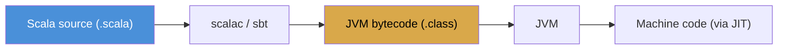

# Compiler vs Interpreter ``

Programming languages need to be translated into machine code that a CPU can execute. There are two main approaches: compilers and interpreters. Scala uses a compiler.

## How an Interpreter Works

An interpreter reads your source code line by line and executes it immediately.

```
Source code -> Interpreter reads each line -> CPU executes
```

Python, JavaScript, and Ruby are interpreted languages. You run the code directly:

```bash
python script.py    # runs immediately
node script.js      # runs immediately
```

Advantages: fast feedback loop, easy to experiment. Disadvantages: errors that could be caught before running only surface at runtime, slower execution for repeated code paths.

## How a Compiler Works

A compiler translates your entire source code into machine code (or an intermediate form) before you run it.

```
Source code -> Compiler -> Bytecode/Machine code -> Runtime executes
```

Scala compiles to JVM bytecode, the same target as Java:

```bash
scalac MyProgram.scala    # compiles to .class files (JVM bytecode)
scala MyProgram           # runs on the JVM
```

Advantages: catches many errors before runtime, optimizes code during compilation, faster execution. Disadvantages: compilation step adds time to the development cycle.

## Scala's Compilation Model

Scala compiles to JVM bytecode. The Java Virtual Machine (JVM) then executes that bytecode. This gives Scala access to:

- The entire Java ecosystem (libraries, frameworks, tools)
- JVM performance optimizations (JIT compilation, garbage collection)
- Cross-platform execution (write once, run on any OS with a JVM)



## Scala.js and Scala Native

Scala also compiles to other targets:

| Target | Output | Use Case |
|--------|--------|----------|
| JVM | Bytecode | Backend, data engineering (primary target) |
| Scala.js | JavaScript | Web frontend, Node.js |
| Scala Native | Native binary | CLI tools, embedded systems |

For data engineering, you always target the JVM. Spark, Akka, and the entire Hadoop ecosystem run on the JVM.

## Why Compilation Matters for Data Engineering

A Spark job that processes 50 TB of data on a 100-node cluster costs real money in compute time. A runtime error that crashes the job after 3 hours of processing wastes that compute time and delays downstream pipelines.

The Scala compiler catches type mismatches, missing method calls, incorrect arguments, and pattern match errors before you submit the job. This is not theoretical hygiene -- it is an economic advantage. Catching a schema mismatch at compile time instead of 3 hours into a production run is the difference between a smooth night and a 2 AM incident.
