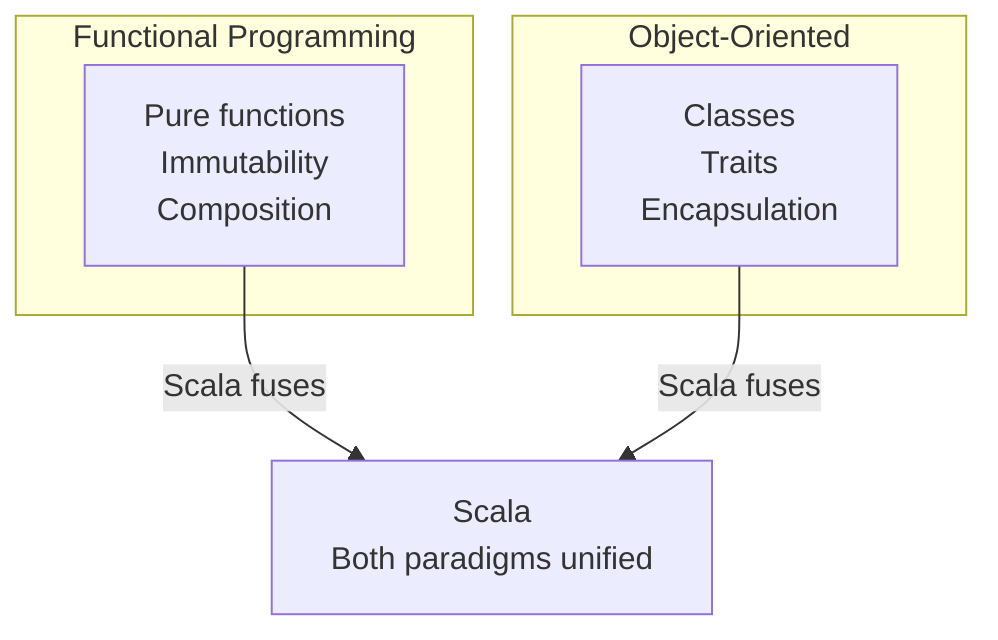

# What Is Scala ``

Scala is a programming language created by Martin Odersky at EPFL (Swiss Federal Institute of Technology) and released in 2004. The name "Scala" is a portmanteau of **scalable language** -- it is designed to grow with the demands of its users, from small scripts to large distributed systems.

## Why Scala Exists

Martin Odersky also co-designed Java generics. He felt Java was too verbose and rigid for complex problems, especially those involving concurrency and data transformation. He wanted a language that:

- Ran on the JVM (access to the Java ecosystem)
- Supported functional programming as a first-class paradigm
- Supported object-oriented programming for structuring code
- Had a concise, expressive syntax
- Caught errors at compile time through a strong type system

Scala was the result.

## FP + OO Fusion

Scala's distinguishing feature is that it does not force you to choose between functional and object-oriented programming. Both paradigms are first-class:



```scala
// OO: organize code into modules with interfaces
trait EventStore[A]:
  def save(event: A): Either[String, Unit]
  def query(id: String): Either[String, A]

// FP: write transformations as pure functions
def process(events: List[RawEvent]): List[CleanEvent] =
  events
    .filter(_.isValid)
    .map(e => CleanEvent(e.id, e.timestamp, parsePayload(e.payload)))
```

You use OO for module boundaries and interfaces. You use FP for data transformations and business logic. The language does not fight you on either front.

## Timeline

| Year | Milestone |
|------|-----------|
| 2001 | Martin Odersky begins designing Scala at EPFL |
| 2004 | Scala 1.0 released |
| 2006 | Scala 2.0 -- improved type system, pattern matching |
| 2011 | Typesafe (now Lightbend) founded to commercialize Scala |
| 2012 | Akka becomes the standard actor framework |
| 2014 | Apache Spark 1.0, written in Scala, gains widespread adoption |
| 2021 | Scala 3.0 released -- new compiler (Dotty), new syntax, given/using replaces implicits |
| 2024 | Scala 3 matures as the default for new projects |
| 2026 | Scala 3.6+ with sbt 2.x, Spark 4.x, Pekko 1.x |

## Scala in Data Engineering

Scala is the language behind Apache Spark, the dominant distributed data processing framework. Spark's core API is written in Scala. While PySpark exists, the Scala API has lower overhead (no Python-JVM serialization boundary), more complete features, and better type safety.

Companies using Scala for data engineering:

| Company | Use Case |
|---------|----------|
| LinkedIn | Real-time data pipelines |
| Netflix | Recommendations infrastructure |
| Airbnb | Data platform, ETL |
| Databricks | Spark development and runtime |
| Spotify | Data infrastructure |
| Stripe | Financial data processing |

These companies chose Scala because their data problems involve high throughput, complex transformations, and correctness guarantees that dynamically typed languages cannot provide at their scale.
