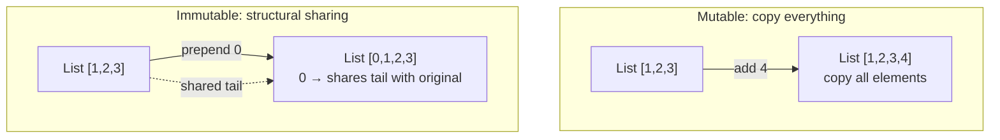

# Immutability ``

Immutable data cannot be changed after creation. In Scala, you default to immutability. Every `val` binding and every standard collection is immutable. This is not a limitation -- it is a correctness guarantee.

## What Immutability Means

```scala
val numbers = List(1, 2, 3)

// Operations return NEW collections
val doubled = numbers.map(_ * 2)  // List(2, 4, 6)

// Original is unchanged
println(numbers)  // List(1, 2, 3)
```

The `doubled` list is a new list. `numbers` is untouched. No function can secretly modify data you hold a reference to.

## Why Immutable Data

**No surprises.** When you pass a list to a function, you know the function cannot modify it. The data you see is the data you get. This eliminates an entire class of bugs where one part of the code mutates data that another part depends on.

**Thread-safe by default.** Multiple threads can read the same immutable data simultaneously without locks. No race conditions, no concurrent modification exceptions. This matters for actor-based systems and Spark, where data flows through concurrent and distributed processes.

**Easier reasoning.** When data never changes, you can understand code by reading it. You do not need to trace mutation through a call chain to know the state of a variable at a given point.

```scala
// BAD: mutation makes this hard to reason about
var total = 0
var count = 0
for item <- items do
  if item.isValid then
    total += item.value
    count += 1
val avg = if count > 0 then total / count else 0

// GOOD: each val is a single expression, easy to read
val validItems = items.filter(_.isValid)
val total = validItems.map(_.value).sum
val count = validItems.length
val avg = if count > 0 then total / count else 0
```

## Copy Instead of Mutate

Case classes provide a `copy` method for creating modified versions:

```scala
case class Event(id: String, status: String, retries: Int)

val original = Event("evt-1", "pending", 0)

// "Modify" by copying with changes
val retry = original.copy(status = "retrying", retries = 1)
val done = original.copy(status = "completed")
```

Each `copy` creates a new instance. `original` remains unchanged. You build a history of transformations instead of overwriting state.

## When Mutability Is Acceptable

There are specific cases where mutability is justified:

- **Inside an actor's receive method.** Actors process one message at a time, so mutable state is safe within a single actor. This is the actor model's contract.
- **Performance-critical hot paths.** When profiling shows that allocation overhead is the bottleneck, mutable buffers or arrays can be used. This is rare.
- **Spark internal operations.** Spark's DataFrame operations are immutable at the API level, but the execution engine uses mutable buffers internally for performance.

For data pipeline code, use immutability unless you have a measured reason not to.

## Immutability at Scale

A common concern: "does creating new collections on every operation waste memory?" Scala's persistent data structures share structure between old and new versions:

```scala
val a = List(1, 2, 3)
val b = 0 :: a   // b = List(0, 1, 2, 3)
```

`b` shares the tail `List(1, 2, 3)` with `a`. Only the new head `0` is allocated. This structural sharing makes immutable collections efficient for most workloads. The JVM's garbage collector handles the rest.


