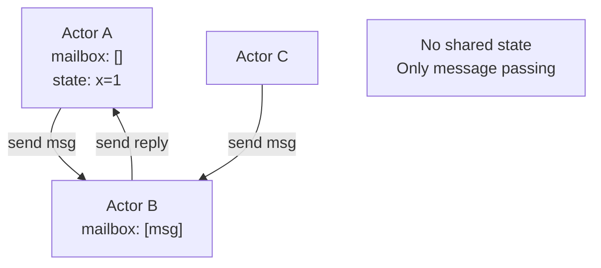
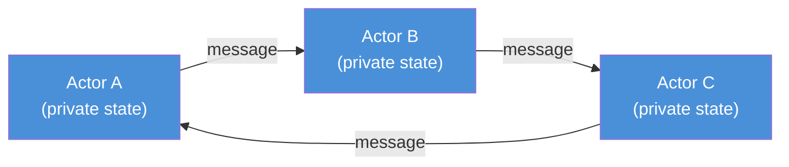
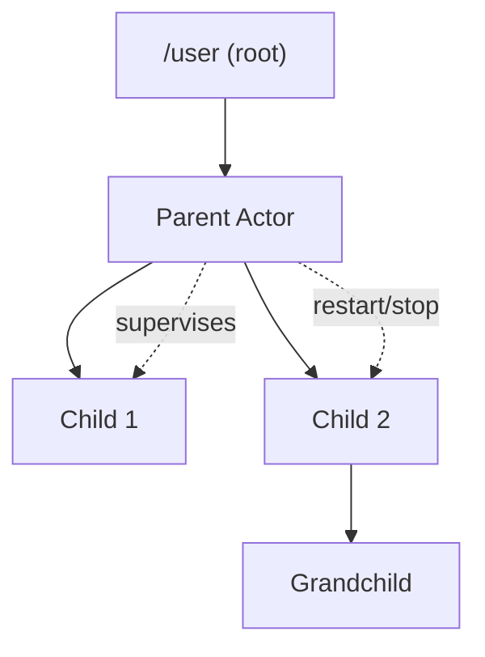

# What Is the Actor Model `` ``

The actor model is a paradigm for building concurrent and distributed systems. Instead of threads, locks, and shared memory, you work with **actors**: independent units of computation that communicate exclusively by sending messages to each other.

## The Problem It Solves

Traditional concurrency uses shared memory protected by locks:

```
Thread A reads sharedState
Thread B reads sharedState
Thread A writes sharedState
Thread B writes sharedState  <-- whose value wins? Data race.
```

Locks fix this but introduce new problems:

- **Deadlock**: Thread A holds Lock 1 and waits for Lock 2. Thread B holds Lock 2 and waits for Lock 1. Both wait forever.
- **Lock contention**: Many threads wait for the same lock, creating a bottleneck.
- **Reasoning difficulty**: To understand a thread's behavior, you must understand every other thread that accesses the same shared state. This is exponential in complexity.

At the scale of distributed data systems -- hundreds of nodes, thousands of concurrent operations -- shared-state concurrency becomes unmanageable.

## The Actor Model's Answer

The actor model eliminates shared mutable state entirely. An actor is:

1. **An independent unit of computation** with private state that no one else can access.
2. **A mailbox** where it receives messages.
3. **Behavior** defined by how it responds to each message.

Actors communicate by sending messages. The rules:



- **No shared state.** Each actor owns its data. Other actors cannot read or write it.
- **Message passing only.** The only way to interact with an actor is to send it a message.
- **One message at a time.** An actor processes messages sequentially. No concurrent access to its state.
- **Asynchronous.** The sender does not wait for the receiver to process the message.



## Why No Shared State Eliminates Bugs

```scala
// TRADITIONAL: shared mutable state, locks needed
class SharedCounter:
  private var count = 0
  def increment(): Unit = synchronized:  // lock required
    count += 1
  def get: Int = synchronized:           // lock required
    count

// ACTOR MODEL: private state, no locks needed
class CounterActor extends Actor:
  private var count = 0  // safe: only this actor touches it
  def receive: Receive =
    case "increment" => count += 1
    case "get"       => sender() ! count
```

The actor's `count` is safe because only one message is processed at a time. No lock. No deadlock possibility. No race condition.

## Supervision: Actors Watch Their Children

Actors form a hierarchy. A parent actor supervises its children. When a child actor fails (throws an exception), the parent decides what to do:



- **Restart**: Create a new actor with fresh state. The most common strategy for data pipelines.
- **Resume**: Skip the failed message and continue.
- **Stop**: Permanently terminate the actor.
- **Escalate**: Pass the decision up to the parent's parent.

This is fault tolerance by design. A failing parser actor does not crash the entire pipeline. Its supervisor restarts it, and upstream actors replay the message.

## Location Transparency

Actors can run on the same JVM or on different machines in a cluster. The code to send a message is identical:

```scala
// Local actor
localActor ! ProcessEvent(event)

// Remote actor (same syntax)
remoteActor ! ProcessEvent(event)
```

The runtime handles serialization, network transport, and message routing. You prototype locally, deploy to a cluster, and change only configuration.

## Why This Is Unique to Scala/Akka

The actor model is not new -- it originated in 1973 (Carl Hewitt). But Akka (and its open-source fork Apache Pekko) made it practical for production systems on the JVM. Scala's concise syntax, pattern matching for message handling, and immutable case classes for messages make actor-based code clean and safe.

Other languages have actor-like libraries (Erlang/Elixir have actors natively, Akka.net exists for C#), but the Scala + Akka combination is the most widely adopted in data engineering because it integrates directly with Spark, Kafka, and the JVM ecosystem.

## When to Use Actors

Use the actor model when:

- You need concurrent processing with mutable state (counters, caches, session management)
- You need fault tolerance via supervision hierarchies
- You need distributed computation across multiple nodes
- You need backpressured streaming (Akka Streams is built on actors)

Do not use actors for:

- Simple request/response HTTP services (use a standard HTTP library)
- Pure data transformations (use plain functions and collections)
- Batch data processing (use Spark)
