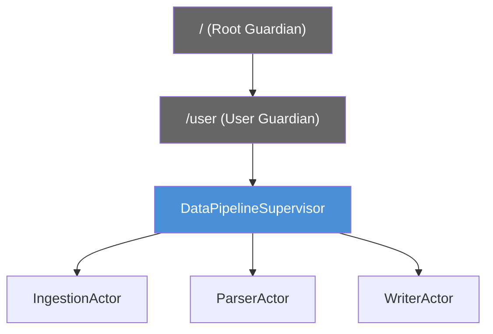

# Supervision ``

When an actor fails, its parent decides what happens. This is supervision: a hierarchical fault tolerance mechanism that is central to building reliable actor systems.

## The Supervision Hierarchy

Every actor has a parent. The top-level guardian actor created by the `ActorSystem` is the root. Actors you create are children of the `/user` guardian. This forms a tree:



When `ParserActor` throws an exception, `DataPipelineSupervisor` (its parent) receives a notification and decides what to do. The failed actor is suspended until the supervisor makes a decision.

## Supervision Strategies

### OneForOneStrategy

Applies the decision to the failed child only. Siblings are unaffected:

```scala
import org.apache.pekko.actor.*
import scala.concurrent.duration.*

class PipelineSupervisor extends Actor:
  // Define how to handle child failures
  override val supervisorStrategy: SupervisorStrategy =
    OneForOneStrategy(
      maxNrOfRetries = 3,          // max restarts
      withinTimeRange = 1.minute   // time window for maxNrOfRetries
    ):
      case _: java.io.IOException   => SupervisorStrategy.Restart
      case _: IllegalArgumentException => SupervisorStrategy.Resume
      case _: Exception             => SupervisorStrategy.Escalate

  def receive: Receive =
    case _ => ()
```

### AllForOneStrategy

Applies the decision to all siblings when any one child fails. Use when siblings are tightly coupled (if one fails, all must restart):

```scala
override val supervisorStrategy: SupervisorStrategy =
  AllForOneStrategy(maxNrOfRetries = 5, withinTimeRange = 2.minutes):
    case _: Exception => SupervisorStrategy.Restart
```

## The Four Decisions

| Decision | What Happens | When to Use |
|----------|-------------|-------------|
| **Restart** | Destroy failed actor, create new one with fresh state. Mailbox is preserved. | Transient failures (network blips, temporary resource unavailability). Most common for data pipelines. |
| **Resume** | Skip the failed message, continue with the next. State is preserved. | Non-critical failures where skipping one message is acceptable (e.g., malformed record in a high-throughput stream). |
| **Stop** | Permanently terminate the actor. | The failure is unrecoverable (corrupted config, missing resource). |
| **Escalate** | Let the parent's parent decide. | The supervisor does not know how to handle this failure. |

> 🖼️ **[IMAGE_PLACEHOLDER]** — supervision strategy OneForOne restart resume stop escalate decision tree

## Step-by-Step Example

```scala
object WriterActor:
  case class Write(record: String)

class WriterActor extends Actor:
  import WriterActor.*

  def receive: Receive =
    case Write(record) =>
      if record.isEmpty then
        throw new IllegalArgumentException("Empty record")
      // Simulate a write operation
      println(s"Written: $record")

object PipelineSupervisor:
  case class StartProcessing(data: List[String])

class PipelineSupervisor extends Actor:
  import PipelineSupervisor.*
  import WriterActor.*

  override val supervisorStrategy: SupervisorStrategy =
    OneForOneStrategy(maxNrOfRetries = 3, withinTimeRange = 1.minute):
      case _: IllegalArgumentException => SupervisorStrategy.Resume
      case _: Exception                => SupervisorStrategy.Restart

  val writer = context.actorOf(Props[WriterActor](), "writer")

  def receive: Receive =
    case StartProcessing(data) =>
      data.foreach(record => writer ! Write(record))
```

When `Write("")` arrives, `WriterActor` throws `IllegalArgumentException`. The supervisor catches it and decides to `Resume` -- skip that message and continue. The empty record is dropped, the pipeline keeps running.

## Why Supervision Matters for Data Pipelines

Data pipelines fail. Network connections drop. External services timeout. Disk fills up. Supervision gives you a systematic way to handle these failures:

- **Transient failures** (network blip): Restart the actor, let upstream replay the message.
- **Bad data** (malformed record): Resume, log the error, skip the record.
- **Catastrophic failures** (out of memory): Escalate to a top-level supervisor that can restart the entire sub-system.

Without supervision, a single failed actor can crash an entire pipeline. With supervision, the pipeline self-heals.
