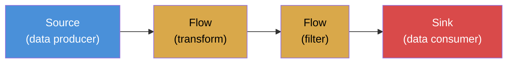

# Akka Streams ``

Akka Streams is a library for processing streams of data with built-in backpressure. It is built on top of the actor model and implements the Reactive Streams specification.

## Why Streams

Some datasets do not fit in memory. A Kafka topic with 10 million events per hour. A log file that grows continuously. A sensor feed that never stops.

Loading all data into a `List` and calling `map` is not an option. You need to process data as it flows through, one element (or batch) at a time. This is streaming.

## Why Backpressure

Without backpressure, a fast producer overwhelms a slow consumer:

```
Kafka (10K msg/sec) -> Parser (can handle 5K msg/sec) -> Database
```

The parser cannot keep up. Messages buffer in memory. Memory fills up. The JVM crashes with OutOfMemoryError.

Backpressure solves this with a feedback loop: the downstream consumer tells the upstream producer how many elements it can handle. The producer only sends that many. If the consumer is slow, the producer slows down.

```
Kafka (10K) -> [backpressure signal: send 5K] -> Parser (5K) -> Database
```

The pipeline self-regulates. No buffer overflow. No crash.

## Stream Components: Source, Flow, Sink



**Source**: Data producer. Emits elements. A Kafka consumer, a file reader, a timer.

**Flow**: A processing stage. Takes elements in, produces elements out. A parser, a filter, an enricher.

**Sink**: Data consumer. Receives elements and writes them somewhere. A database writer, a file writer, a logger.

## Step-by-Step Example

```scala
import org.apache.pekko.actor.ActorSystem
import org.apache.pekko.stream.scaladsl.*
import org.apache.pekko.stream.*
import scala.concurrent.Future

given system: ActorSystem = ActorSystem("StreamExample")
import system.executionContext

// 1. Define a Source
val source: Source[Int, NotUsed] = Source(1 to 1000)

// 2. Define Flows (transformations)
val doubler: Flow[Int, Int, NotUsed] = Flow[Int].map(_ * 2)
val filterEven: Flow[Int, Int, NotUsed] = Flow[Int].filter(_ % 4 == 0)

// 3. Define a Sink
val sink: Sink[Int, Future[Done]] = Sink.foreach(n => println(n))

// 4. Connect and run
val result = source
  .via(doubler)
  .via(filterEven)
  .toMat(sink)(Keep.right)
  .run()
```

Step by step:

1. `Source(1 to 1000)` creates a source that emits integers 1 through 1000.
2. `Flow[Int].map(_ * 2)` doubles each integer. `Flow[Int].filter(_ % 4 == 0)` keeps multiples of 4.
3. `Sink.foreach(println)` prints each element.
4. `.via()` connects a flow. `.toMat()` connects a sink. `.run()` materializes and executes the stream.

## A Data Pipeline Example

```scala
case class RawEvent(id: String, payload: String)
case class CleanEvent(id: String, value: Double)

val eventSource: Source[RawEvent, NotUsed] = Source(List(
  RawEvent("e1", "10.5"),
  RawEvent("e2", "invalid"),
  RawEvent("e3", "25.0"),
  RawEvent("e4", "42.0")
))

val parseFlow: Flow[RawEvent, CleanEvent, NotUsed] =
  Flow[RawEvent]
    .map: event =>
      event.payload.toDoubleOption.map(v => CleanEvent(event.id, v))
    .collect:
      case Some(clean) => clean

val aggregateSink: Sink[CleanEvent, Future[Done]] =
  Sink.foreach(event => println(s"Stored: ${event.id} = ${event.value}"))

val pipeline = eventSource
  .via(parseFlow)
  .toMat(aggregateSink)(Keep.right)

pipeline.run()
```

The `parseFlow` parses the payload to a `Double`. Invalid payloads (like "invalid") become `None` and are filtered out by `collect`. Only valid `CleanEvent` values reach the sink.

## Materialization

Defining sources, flows, and sinks creates a **blueprint**. Nothing runs until you call `.run()`. This is materialization: Akka allocates actors, buffers, and network connections to execute the blueprint.

A single blueprint can be materialized multiple times with different configurations. Define once, run many times.

## When to Use Akka Streams vs Spark

| Aspect | Akka Streams | Spark Streaming |
|--------|-------------|-----------------|
| Latency | Milliseconds | Sub-second to seconds |
| Model | True streaming (one at a time) | Micro-batching |
| State | Custom | Checkpointing |
| SQL | No | Yes |
| Scale | Single node to cluster | Cluster only |
| Best for | Low-latency event processing | Large-scale data aggregation |

Use Akka Streams when you need low-latency processing, fine-grained backpressure control, or when your data volume fits on one machine. Use Spark Streaming when you need to aggregate large datasets with SQL semantics.
