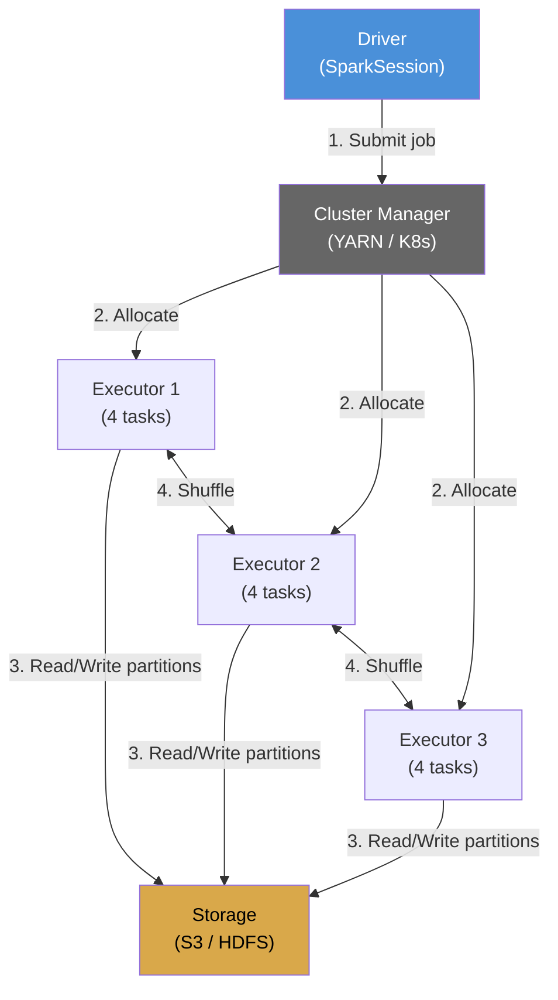

# What Is Spark `[Entry]`

Apache Spark is a distributed data processing engine. It splits large datasets across multiple machines, processes them in parallel, and combines the results. Spark is written in Scala and runs on the JVM.

## Why Spark Exists

Before Spark, Hadoop MapReduce was the standard for big data processing. MapReduce wrote intermediate results to disk between every stage. A 4-stage pipeline wrote to disk 3 times. This made MapReduce slow for iterative and interactive workloads.

Spark keeps data in memory between stages. A 4-stage pipeline reads from disk once and writes once. For iterative algorithms (ML training) and interactive queries, Spark is 10-100x faster than MapReduce.

## The Three Abstractions

| Abstraction | Level | When to Use |
|-------------|-------|-------------|
| DataFrames / Spark SQL | High | Most data engineering tasks. Optimized by Catalyst. |
| Datasets | Typed | When you need compile-time type safety on rows. |
| RDDs | Low | Fine-grained control over partitioning. Rare in 2026. |

Use DataFrames. The Catalyst optimizer transforms DataFrame operations into an efficient execution plan. Write readable code, get optimized execution.

## The Mental Model: Driver, Executors, Partitions



Step by step:

1. **Driver**: Your SparkSession. It converts your code into a logical plan, optimizes it, and splits it into tasks.
2. **Cluster Manager**: Allocates executors on worker nodes. Spark supports YARN, Kubernetes, and its own standalone cluster manager.
3. **Executors**: JVM processes on worker nodes. Each executor runs tasks and stores cached data. Data is split into **partitions** -- each partition is processed by one task on one executor.
4. **Shuffle**: When data needs to be reorganized across partitions (e.g., `groupBy`), executors exchange data over the network. Shuffles are the most expensive operation in Spark.

## A First Spark Job

```scala
import org.apache.spark.sql.SparkSession
import org.apache.spark.sql.functions.*

val spark = SparkSession.builder()
  .appName("FirstJob")
  .master("local[*]")  // local mode for development
  .getOrCreate()

import spark.implicits.*

// Read data
val df = spark.read
  .option("header", "true")
  .csv("data/events.csv")

// Transform
val result = df
  .filter(col("event_type").isNotNull)
  .groupBy("event_type")
  .count()
  .orderBy(col("count").desc)

// Show results
result.show()
```

When you run this in local mode, the driver and executor run in the same JVM. When you deploy to a cluster, the driver submits tasks to remote executors. The code does not change.

## Lazy Evaluation

Spark transformations are lazy. Calling `filter`, `groupBy`, or `withColumn` does not execute anything. It builds a logical plan. Execution happens only when you call an **action**: `show`, `collect`, `write`, `count`.

```scala
val transformed = df
  .filter(col("amount") > 100)    // lazy
  .withColumn("fee", col("amount") * 0.03)  // lazy
  .groupBy("category").sum("fee") // lazy

transformed.show()  // THIS triggers execution
```

Lazy evaluation allows Catalyst to see the entire pipeline and optimize it as a whole. Predicate pushdown, column pruning, and join reordering happen across the entire plan, not stage by stage.
