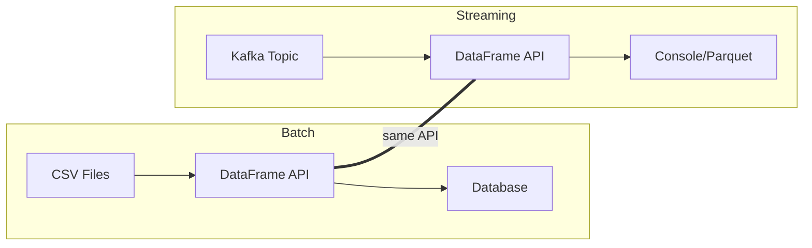
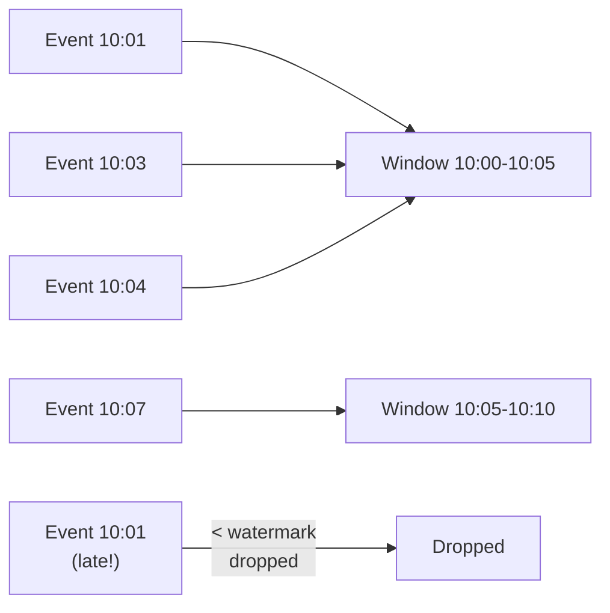

# Structured Streaming ``

Structured Streaming is Spark's API for continuous data processing. It treats a stream as an unbounded table: new rows are appended as data arrives. You write the same DataFrame operations you would use for batch, and Spark executes them continuously.

## The Mental Model

```
Batch:  read file -> transform -> write file
Stream: read stream -> transform (continuously) -> write stream
```

The transformation code is identical. The difference is the source and sink:



```scala
import org.apache.spark.sql.SparkSession
import org.apache.spark.sql.functions.*
import spark.implicits.*

val spark = SparkSession.builder()
  .appName("StreamProcessing")
  .getOrCreate()

// Read from Kafka as a stream
val rawStream = spark.readStream
  .format("kafka")
  .option("kafka.bootstrap.servers", "localhost:9092")
  .option("subscribe", "events")
  .option("startingOffsets", "latest")
  .load()

// Transform (same DataFrame operations as batch)
val parsed = rawStream
  .select(
    col("key").cast("string").as("eventId"),
    col("value").cast("string").as("payload"),
    col("timestamp").as("kafkaTimestamp")
  )
  .withColumn("eventType", get_json_object(col("payload"), "$.type"))
  .withColumn("amount", get_json_object(col("payload"), "$.amount").cast("double"))
  .filter(col("eventType").isNotNull)

// Write to console (for development)
val query = parsed.writeStream
  .format("console")
  .outputMode("append")
  .option("truncate", "false")
  .start()

query.awaitTermination()
```

Step by step:

1. `spark.readStream` creates a streaming DataFrame. Data arrives continuously from Kafka.
2. Transformations (`select`, `withColumn`, `filter`) are the same as batch DataFrames.
3. `writeStream` starts the streaming query. `format("console")` prints to the terminal. In production, use `format("parquet")` or `format("kafka")`.

## Output Modes

| Mode | Description | When to Use |
|------|-------------|-------------|
| `append` | Only new rows are written | Stateless transformations, sinks that do not support updates |
| `complete` | Entire result table is written | Aggregations where you need the full picture |
| `update` | Only changed rows are written | Aggregations where downstream systems handle updates |

Use `append` for simple transformations (parse, filter, enrich). Use `complete` for aggregations written to systems that replace the entire result (like in-memory dashboards). Use `update` for aggregations where downstream systems can handle row-level updates.

## Windowed Aggregations

```scala
val windowed = parsed
  .withWatermark("kafkaTimestamp", "5 minutes")  // drop late data > 5 min
  .groupBy(
    window(col("kafkaTimestamp"), "1 hour"),
    col("eventType")
  )
  .agg(
    count("*").as("eventCount"),
    sum("amount").as("totalAmount")
  )

val windowQuery = windowed.writeStream
  .format("console")
  .outputMode("update")
  .option("truncate", "false")
  .start()
```

`window(col("timestamp"), "1 hour")` creates tumbling 1-hour windows. `withWatermark` defines how late data is accepted -- events arriving more than 5 minutes after the window closes are dropped.



## Exactly-Once Semantics

Structured Streaming provides exactly-once processing through checkpointing:

```scala
val query = parsed.writeStream
  .format("parquet")
  .option("path", "s3://data-lake/streaming/events/")
  .option("checkpointLocation", "s3://data-lake/streaming/checkpoints/events/")
  .partitionBy("eventType")
  .start()
```

The checkpoint location stores the processing progress. If the stream fails and restarts, it resumes from the last committed offset. No duplicate processing. No data loss.

## When Streaming vs Batch

| Factor | Batch | Streaming |
|--------|-------|-----------|
| Latency | Minutes to hours | Seconds |
| Data volume | Fixed per run | Continuous |
| Cost | Batch compute | Continuous compute |
| Complexity | Lower | Higher (checkpointing, watermarks, late data) |
| Use case | Daily reports, ETL | Real-time dashboards, alerting, enrichment |

Start with batch. Add streaming only when the business requirement demands low latency. Most data pipelines are fine with hourly or daily batch processing.
