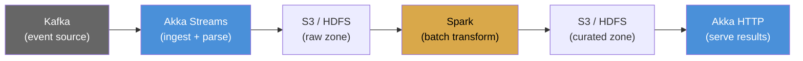

# Capstone: Build a Data Pipeline

Build an end-to-end data pipeline that combines the three pillars of this roadmap: functional programming, the actor model, and Apache Spark.

## Architecture



The pipeline has four stages:

1. **Ingest**: Akka Streams reads events from Kafka, parses and validates them, writes raw events to S3.
2. **Transform**: A Spark batch job reads raw events, aggregates them, writes curated results to S3.
3. **Serve**: An Akka HTTP service reads curated results and exposes them via REST API.
4. **Monitor**: Prometheus metrics and structured logging throughout.

## Stage 1: Ingest with Akka Streams

```scala
// IngestStream.scala
import org.apache.pekko.actor.ActorSystem
import org.apache.pekko.stream.scaladsl.*
import org.apache.pekko.stream.*
import scala.concurrent.Future

given system: ActorSystem = ActorSystem("ingest")
import system.executionContext

case class RawEvent(id: String, eventType: String, timestamp: Long, payload: String)
case class ValidEvent(id: String, eventType: String, timestamp: Long, amount: Double)

val kafkaSource: Source[RawEvent, NotUsed] =
  Source.repeat(()).map(_ =>
    // In production: read from Kafka
    RawEvent(
      id = java.util.UUID.randomUUID.toString,
      eventType = scala.util.Random.nextString(1) match
        case "c" => "click"
        case "p" => "purchase"
        case _   => "pageview"
      ,
      timestamp = System.currentTimeMillis(),
      payload = """{"amount":42.0}"""
    )
  )

val validateFlow: Flow[RawEvent, ValidEvent, NotUsed] =
  Flow[RawEvent]
    .map: raw =>
      val amount = parseAmount(raw.payload)
      if raw.eventType.nonEmpty && amount > 0 then
        Right(ValidEvent(raw.id, raw.eventType, raw.timestamp, amount))
      else
        Left(s"Invalid event: ${raw.id}")
    .collect:
      case Right(valid) => valid

val fileSink: Sink[ValidEvent, Future[Done]] =
  Sink.foreach: event =>
    // In production: write to S3 or HDFS
    println(s"Ingested: ${event.id} ${event.eventType} $$${event.amount}")

val pipeline = kafkaSource
  .throttle(100, scala.concurrent.duration.FiniteDuration(1, "second"))
  .via(validateFlow)
  .toMat(fileSink)(Keep.right)

pipeline.run()

def parseAmount(payload: String): Double =
  val pattern = """"amount":(\d+\.?\d*)""".r
  pattern.findFirstMatchIn(payload).map(_.group(1).toDouble).getOrElse(0.0)
```

## Stage 2: Transform with Spark

```scala
// TransformBatch.scala
import org.apache.spark.sql.SparkSession
import org.apache.spark.sql.functions.*

val spark = SparkSession.builder()
  .appName("EventTransform")
  .master("local[*]")
  .getOrCreate()

import spark.implicits.*

// Read raw events (in production: from S3)
val raw = Seq(
  ("e1", "click", 1718000000000L, 0.0),
  ("e2", "purchase", 1718000060000L, 49.99),
  ("e3", "purchase", 1718000120000L, 129.50),
  ("e4", "click", 1718000180000L, 0.0),
  ("e5", "purchase", 1718000240000L, 75.00)
).toDF("id", "eventType", "timestamp", "amount")

val curated = raw
  .withColumn("eventDate", to_date(col("timestamp") / 1000))
  .withColumn("hour", hour(to_timestamp(col("timestamp") / 1000)))
  .filter(col("eventType").isNotNull)
  .groupBy("eventDate", "hour", "eventType")
  .agg(
    count("*").as("eventCount"),
    sum("amount").as("totalRevenue"),
    avg("amount").as("avgAmount"),
    max("amount").as("maxAmount")
  )

curated.show()
// In production: curated.write.mode("overwrite").partitionBy("eventDate").parquet("s3://...")

spark.stop()
```

## Stage 3: Serve with Akka HTTP

```scala
// ServeApi.scala
import org.apache.pekko.actor.ActorSystem
import org.apache.pekko.http.scaladsl.Http
import org.apache.pekko.http.scaladsl.model.*
import org.apache.pekko.http.scaladsl.server.Directives.*
import scala.concurrent.Future

given system: ActorSystem = ActorSystem("api")
import system.executionContext

// In production: read from curated zone
val mockData = """
  {
    "2026-06-08": {
      "purchase": {"count": 3, "revenue": 254.49},
      "click": {"count": 2, "revenue": 0.0}
    }
  }
"""

val route =
  path("health"):
    get:
      complete(HttpEntity(ContentTypes.`text/plain`, "OK"))

  ~ path("events" / "summary"):
    get:
      complete(HttpEntity(ContentTypes.`application/json`, mockData))

  ~ path("events" / Segment): date =>
    get:
      complete(HttpEntity(ContentTypes.`application/json`,
        s"""{"date":"$date","status":"data available"}"""
      ))

val binding = Http().newServerAt("0.0.0.0", 8080).bind(route)
```

## Exercises

`[Entry]` Extend the ingest stage to handle a new event type ("refund"). Add validation logic in the `validateFlow`.

`[Mid]` Add a windowed aggregation to the Spark job: compute hourly revenue, not just daily. Write results partitioned by date and hour.

`[Senior]` Add end-to-end tests: start the ingest stream, run the Spark job, query the API, assert the results match. Use test containers for Kafka and a local Spark session.

`[Senior]` Add Prometheus metrics to all three stages. Track events ingested per second, Spark job duration, and API request latency. Set up alerts for latency and error rate.
