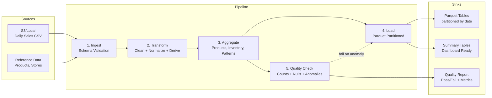

# Capstone: Daily Sales Analytics — Batch ETL Pipeline

**Roadmap:** scala-data-engineering (Spark + Scala)
**Architecture:** Data Pipeline (Batch ETL)
**Business Domain:** Retail Analytics — Daily Sales Data
**Challenge Repo:** https://github.com/TP-Coder-Innovation-Hub/batch-etl-pipeline-challenge

---

## Business Context

A retail chain captures sales transactions across hundreds of stores daily as CSV files. Leadership needs next-day dashboards answering: What are our top sellers? Which stores are over/under stocked? What buying patterns are emerging by season and customer segment?

You will build a batch ETL pipeline in Spark + Scala that ingests raw daily sales, cleans and normalizes the data, computes aggregations, and publishes Parquet datasets ready for dashboard consumption. The pipeline must run idempotently (safe to re-run the same day) and fail loudly when data quality degrades.

**Input:** Raw daily sales CSV files (S3 or local directory).
**Output:** Partitioned Parquet tables + summary tables for dashboards.

---

## Learning Objectives

By completing this capstone you will demonstrate:

- Spark DataFrame API with Scala (selection, filtering, joins, window functions)
- Modeling domain entities with Scala case classes (`Sale`, `Product`, `Store`, `DailyReport`)
- Partitioning and file-format optimization (Parquet with compression)
- Idempotent pipeline design (re-running the same day produces no duplicates)
- Data quality checks as a distinct validation stage (counts, nulls, anomaly detection)
- Test-driven development for transformation logic (unit tests with Spark local session)

---

## Architecture

**Pipeline Stages**

1. **Ingest** — Read daily sales CSV from S3/local; validate schema against expected types.
2. **Transform** — Clean data, deduplicate, normalize product categories, compute derived fields (revenue, margins, time buckets).
3. **Aggregate** — Product performance (top sellers, revenue by category), inventory levels across stores, buying patterns (seasonal trends, customer segments).
4. **Load** — Write Parquet partitioned by date with compression; emit summary tables for dashboards.
5. **Quality Check** — Row-count validation, null checks on required fields, anomaly detection (sales spike > 3x average).

---

## Feature Requirements

### FR-1: CSV Ingestion with Schema Validation

Read daily sales CSV files and enforce a strict schema.

- Accept input path via CLI argument or config (S3 URI or local dir).
- Apply an explicit schema (column names + types) — reject malformed records to a quarantine sink.
- Join reference data (products, stores) at this stage.
- Report record counts ingested vs. quarantined.

**Acceptance Criteria**
- [ ] Pipeline ingests a sample daily CSV and prints ingested/quarantined counts.
- [ ] Rows with wrong types or missing required ingest fields are quarantined, not dropped silently.
- [ ] A configurable date parameter selects which day to process (`--date YYYY-MM-DD`).

---

### FR-2: Data Transformation

Clean, normalize, and enrich the raw data into an analytics-ready dataset.

- Remove exact duplicates (same transaction id).
- Normalize product categories to a canonical taxonomy.
- Compute derived fields: gross revenue, discounts applied, net revenue, order hour bucket.
- Handle nulls in non-critical fields with documented defaults; propagate nulls in critical fields to DQ stage.

**Acceptance Criteria**
- [ ] No duplicate transaction ids in the transformed dataset.
- [ ] All product categories map to the canonical set (unmapped flagged).
- [ ] Net revenue is computed and validated against gross - discounts.
- [ ] Transformation functions are covered by unit tests using a Spark local session.

---

### FR-3: Aggregation

Produce the analytical datasets the business needs.

- **Product Performance** — top N sellers by units and revenue; revenue by category.
- **Inventory Levels** — units sold per store per product (input to stock recommendations).
- **Buying Patterns** — seasonal trends (rolling windows), customer segment breakdowns.

**Acceptance Criteria**
- [ ] Top-sellers ranking matches a hand-computed expected result on sample data.
- [ ] Store/product sales totals reconcile to the transformed dataset grand total.
- [ ] At least one window-function-based metric (e.g., 7-day rolling revenue) is produced.

---

### FR-4: Output to Parquet

Persist results efficiently for downstream consumers.

- Write all analytical datasets as Parquet with Snappy compression.
- Partition primary fact table by date (`dt=YYYY-MM-DD`).
- Idempotent writes: re-running for the same date overwrites that partition without producing duplicates.
- Summary tables written for dashboard consumption (denormalized, small, fast to scan).

**Acceptance Criteria**
- [ ] Output files are Parquet with Snappy compression (verifiable via metadata).
- [ ] Re-running the pipeline for the same date yields identical row counts (no duplication).
- [ ] Partition pruning works: reading a single date scans only that partition.

---

### FR-5: Data Quality Checks

A separate validation stage that gates pipeline success.

- **Row counts** — transformed row count within expected bounds vs. ingest.
- **Null checks** — required fields (transaction id, product id, store id, net revenue) are non-null.
- **Anomaly detection** — flag any product/store/day whose sales exceed 3x its trailing average.
- Emit a quality report (metrics + pass/fail). On failure, the pipeline exits non-zero and blocks downstream publish.

**Acceptance Criteria**
- [ ] Injected nulls in required fields cause the pipeline to fail with a clear message.
- [ ] A synthetic 4x sales spike is detected and reported.
- [ ] A passing run produces a machine-readable quality report (JSON or Parquet).

---

## Tech Constraints

- Must use **Apache Spark with Scala** (DataFrame API).
- Must use **Parquet** for all output datasets.
- Must include **data quality checks** as a distinct stage.
- Must be **idempotent** — safe to re-run for the same date.
- Must include **unit tests** for transformation logic.
- Must ship a **Docker Compose** file running a Spark standalone cluster (master + worker(s)).

---

## Architecture Decision Records

### ADR-1: DataFrame API over RDDs

**Context:** Spark offers RDD, DataFrame, and Dataset APIs.
**Decision:** Use the DataFrame API with case-class schemas.
**Consequence:** Catalyst optimization and Tungsten execution apply automatically; code stays concise and testable. Trade-off: less low-level control than RDDs, which is unnecessary here.

### ADR-2: Parquet with Snappy, Partitioned by Date

**Context:** Output must support dashboards and re-runs.
**Decision:** Parquet (Snappy) partitioned by `dt=YYYY-MM-DD`.
**Consequence:** Columnar compression reduces storage and speeds scans; date partitioning enables pruning and idempotent overwrite of a single day. Trade-off: small daily partitions can cause small-file problems for very wide date ranges — acceptable for daily cadence.

### ADR-3: Idempotency via Partition Overwrite

**Context:** Re-runs for the same day must not duplicate data.
**Decision:** Use dynamic partition overwrite — writing a date partition replaces only that partition.
**Consequence:** Operators can safely retry a failed day. Trade-off: requires overwrite mode and careful path management; intermediate state is not transactional across all datasets.

### ADR-4: Data Quality as a Separate Stage

**Context:** Bad data can silently corrupt dashboards.
**Decision:** Run a dedicated DQ stage after aggregation; block the publish on failure.
**Consequence:** Downstream consumers only see validated data; failures are loud. Trade-off: adds latency and complexity, but prevents silent corruption.

### ADR-5: Spark Standalone via Docker Compose

**Context:** The capstone must run locally without a managed cluster.
**Decision:** Ship Docker Compose with a Spark standalone master and worker(s).
**Consequence:** Reproducible local execution and grading. Trade-off: standalone mode lacks production cluster features (dynamic allocation, YARN/K8s scheduling) — out of scope for this capstone.

---

## Submission Checklist

- [ ] Source code in the challenge repo under the structure specified by its README.
- [ ] `docker-compose.yml` bringing up a Spark standalone cluster.
- [ ] CLI entrypoint accepting `--date` and input/output paths.
- [ ] All five pipeline stages implemented (Ingest, Transform, Aggregate, Load, Quality Check).
- [ ] Output written as Parquet (Snappy), date-partitioned, idempotent.
- [ ] Unit tests for transformation logic (runnable via `sbt test` or equivalent).
- [ ] Quality report emitted on each run.
- [ ] README documenting how to build, run, test, and re-run for the same date.
- [ ] Sample input data and expected-output fixtures for grading.
