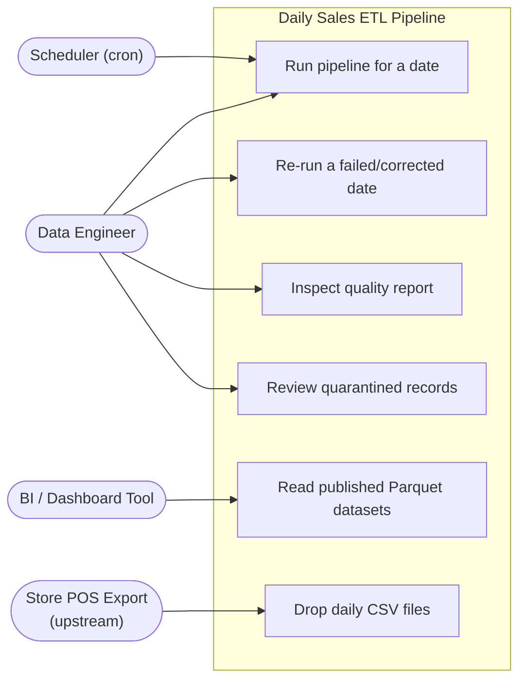
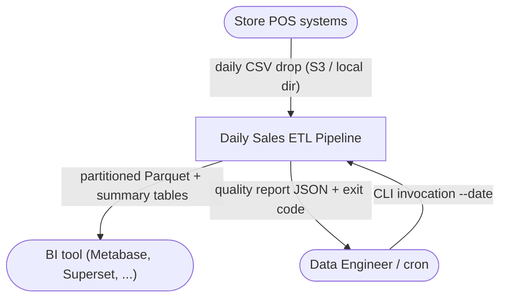
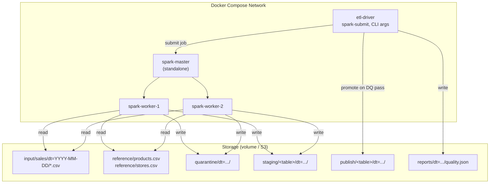
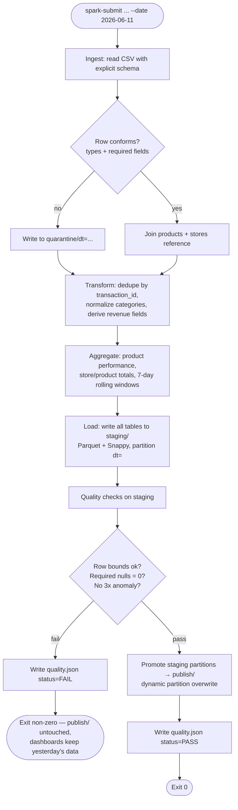
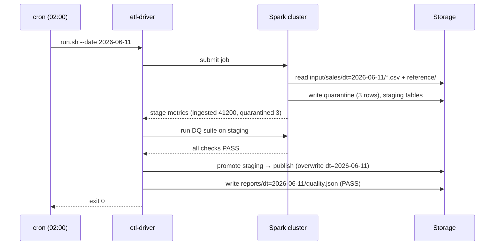
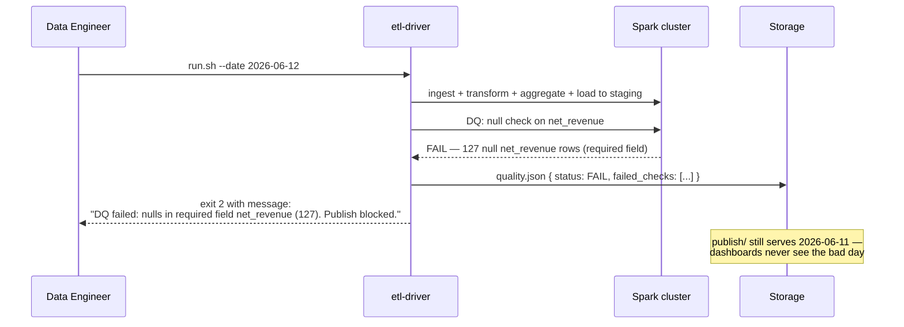
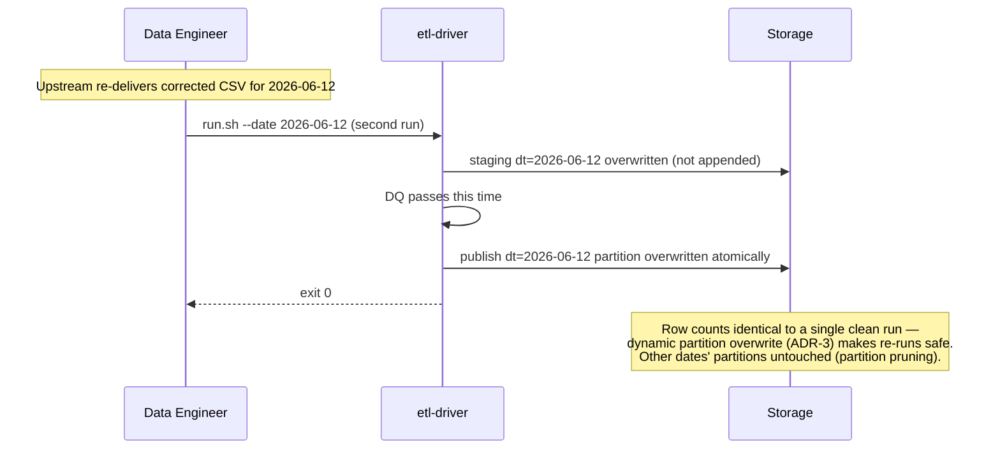

# Capstone Design: Daily Sales Analytics — Batch ETL Pipeline

> Companion to [01-capstone-spec.md](./01-capstone-spec.md). This capstone has **no frontend and no REST API** — the "contracts" here are the CLI, the dataset schemas, and the quality report. Code organization is yours.

## Design Notes (read first)

1. **The dashboard is somebody else's job.** Output Parquet is consumed by an external BI tool (the spec's "dashboard consumption"). Your deliverable ends at validated, partitioned Parquet plus a quality report. Resist building a viewer.
2. **Schemas are the API.** In a pipeline, the input CSV schema, reference data schemas, and output table schemas play the role REST contracts play in a service. Part 4 defines them precisely; treat a column rename with the same gravity as breaking an endpoint.
3. **The DQ gate writes to staging first.** "On failure, block downstream publish" requires that aggregates aren't visible to consumers until DQ passes. Design: Load writes to `staging/`, DQ validates, and only on pass are partitions promoted to `publish/` (move/overwrite). Re-running a failed day is then trivially safe.
4. **Anomaly detection needs history.** "3× trailing average" requires prior days' aggregates. The pipeline reads its own published `daily_store_product` output for the trailing 7 days — first runs (no history) skip the anomaly check with an explicit `SKIPPED_NO_HISTORY` status, never a silent pass.

---

## Part 1: High-Level Design

### 1.1 Use-Case Diagram



### 1.2 System Context Diagram



### 1.3 Container Diagram



One Spark application, five logical stages. The staging → publish promotion (Design Note 3) is driver-side path management, not a Spark job.

### 1.4 Activity Diagram — One Pipeline Run



### 1.5 Sequence Diagrams

#### 1.5.1 Happy path — scheduled nightly run



#### 1.5.2 Error path — injected nulls fail the gate



#### 1.5.3 Idempotent re-run — corrected data, same date



---

## Part 2: Interface Design (no frontend)

### 2.1 Frontend Justification

**None — deliberately.** The consumers are a BI tool (reads Parquet) and operators (read exit codes and `quality.json`). A web UI would duplicate what Metabase/Superset already do and distract from the pipeline craft this capstone grades. The "user interface" is the CLI and the report.

### 2.2 CLI Contract

```text
spark-submit ... etl-assembly.jar \
  --date 2026-06-11                  # required, YYYY-MM-DD; which input partition to process
  --input  s3a://bucket/input        # or local path; default from application.conf
  --output s3a://bucket/warehouse    # root for staging/ publish/ quarantine/ reports/
  --top-n 20                         # optional, top-sellers ranking size (default 20)
  --skip-anomaly-check               # optional, explicit override (logged loudly)
```

| Exit code | Meaning |
|---|---|
| 0 | Run complete, DQ passed, partitions published |
| 1 | Infrastructure/runtime failure (cluster, IO, OOM) |
| 2 | Data quality failure — publish blocked, see quality.json |
| 3 | Invalid arguments / missing input partition |

### 2.3 Scheduling

Nightly cron (02:00, after POS export lands) invoking `run.sh --date $(date -d yesterday +%F)`. Re-runs are manual with an explicit `--date`. Document in the README: the pipeline never *discovers* dates — the date is always an explicit argument (this is what makes backfills and idempotency reasoning simple).

---

## Part 3: Data Contracts (in place of API contracts)

### Input: daily sales CSV (`input/sales/dt=YYYY-MM-DD/*.csv`)

| Column | Type | Required | Notes |
|---|---|---|---|
| transaction_id | string (uuid) | yes | dedup key |
| store_id | string | yes | must join `stores` |
| product_id | string | yes | must join `products` |
| quantity | int | yes | > 0 |
| unit_price | decimal(10,2) | yes | THB |
| discount | decimal(10,2) | no | default 0.00 |
| customer_segment | string | no | `retail` \| `member` \| `wholesale`; default `retail` |
| sold_at | timestamp | yes | must fall on `--date` (off-date rows quarantined) |

Violation of a *required* column → quarantine row with a `_reason` column appended. Non-required nulls → documented defaults (FR-2).

### Reference data

`reference/products.csv`: `product_id, product_name, raw_category, unit_cost` · `reference/stores.csv`: `store_id, store_name, region, province`

Category normalization map (`reference/category_mapping.csv`): `raw_category → canonical_category`; unmapped raw categories pass through flagged `UNMAPPED` (never dropped, counted in DQ).

### Output: quality report (`reports/dt=.../quality.json`)

```json
{
  "date": "2026-06-11",
  "status": "PASS",
  "run_id": "2026-06-12T02:00:14Z-7f3a",
  "metrics": {
    "rows_ingested": 41200, "rows_quarantined": 3, "rows_transformed": 41189,
    "duplicate_transaction_ids_removed": 8, "unmapped_categories": 1
  },
  "checks": [
    { "name": "row_count_bounds", "status": "PASS", "detail": "41189 within [0.5x, 1.5x] of 7-day mean 39800" },
    { "name": "required_nulls", "status": "PASS", "detail": "0 nulls in transaction_id, product_id, store_id, net_revenue" },
    { "name": "sales_anomaly_3x", "status": "PASS", "detail": "0 store/product/day cells over 3x trailing-7d avg" }
  ]
}
```

`status` ∈ `PASS | FAIL`; per-check `status` ∈ `PASS | FAIL | SKIPPED_NO_HISTORY`. This file is machine-readable on purpose — an orchestrator (Airflow, cron + alert script) keys off it.

---

## Part 4: Dataset Schemas (in place of database schema)

All outputs: Parquet, Snappy, under `publish/<table>/`. Spark schema given as case-class fields (DataFrame API with case-class schemas, ADR-1).

```text
-- Fact table: publish/sales_fact/dt=YYYY-MM-DD/
SaleFact(
  transaction_id: String,         // unique within partition (post-dedup)
  store_id: String, store_name: String, region: String,
  product_id: String, product_name: String,
  canonical_category: String,     // 'UNMAPPED' allowed, flagged
  customer_segment: String,
  quantity: Int,
  unit_price: BigDecimal, discount: BigDecimal,
  gross_revenue: BigDecimal,      // quantity * unit_price
  net_revenue: BigDecimal,        // gross - discount  (DQ validates the identity)
  unit_cost: BigDecimal, margin: BigDecimal,   // net - quantity * unit_cost
  sold_at: Timestamp, hour_bucket: Int,        // 0-23
  dt: String                      // partition column YYYY-MM-DD
)

-- Summary: publish/product_performance/dt=.../     (small, dashboard-ready)
ProductPerformance(dt, product_id, product_name, canonical_category,
  units_sold: Long, net_revenue: BigDecimal, revenue_rank: Int, units_rank: Int)

-- Summary: publish/category_revenue/dt=.../
CategoryRevenue(dt, canonical_category, net_revenue: BigDecimal, share_of_day: Double)

-- Summary: publish/daily_store_product/dt=.../     (inventory input + anomaly history)
DailyStoreProduct(dt, store_id, product_id, units_sold: Long, net_revenue: BigDecimal)

-- Summary: publish/buying_patterns/dt=.../
BuyingPatterns(dt, canonical_category, customer_segment,
  units_sold: Long, net_revenue: BigDecimal,
  rolling_7d_revenue: BigDecimal,   // window function over trailing 7 published days (FR-3)
  hour_bucket_mode: Int)            // most active hour

-- Quarantine: quarantine/dt=.../  (raw input columns as strings + _reason: String)
```

Non-obvious decisions: `sales_fact` carries denormalized store/product names — dashboard queries must not need joins; `daily_store_product` doubles as the anomaly-check history source (Design Note 4), which is why it must publish even on quiet days; all money is `BigDecimal` end-to-end — `Double` revenue is an automatic review failure.

---

## Part 5: Event Contracts

**N/A.** Batch pipeline, no message broker, no streaming. The asynchronous boundary in this system is the daily file drop, covered by the input contract in Part 3. (If you later convert this to Structured Streaming, that's a different capstone — see the streaming-analytics challenge.)

---

## Part 6: Seed / Fixture Data

Fixtures live in `fixtures/` and are the grading inputs (Submission Checklist requires them). Three days of data, ~200 rows/day generated by a seed script, plus hand-crafted edge rows:

**`fixtures/input/sales/dt=2026-06-09/sales.csv`** — clean baseline day (~200 rows, all valid). Establishes trailing history.

**`fixtures/input/sales/dt=2026-06-10/sales.csv`** — clean day 2 with one product (P-RICE) selling 2× its 06-09 volume (below the 3× threshold — must NOT trigger anomaly).

**`fixtures/input/sales/dt=2026-06-11/sales.csv`** — the edge-case day:

| Rows | Edge case | Expected behavior |
|---|---|---|
| 2 rows, same `transaction_id` T-DUP-001 | exact duplicate | one survives dedup; `duplicate_transaction_ids_removed: 1` |
| 1 row, `quantity` = `"two"` | type violation | quarantined, `_reason: TYPE_MISMATCH:quantity` |
| 1 row, missing `store_id` | required null | quarantined at ingest |
| 1 row, `sold_at` = 2026-06-10 | off-date record | quarantined, `_reason: DATE_MISMATCH` |
| 3 rows, `raw_category` = `"Snacks & Crisps"` (unmapped) | taxonomy gap | pass through as `UNMAPPED`, counted in report |
| 1 row, `discount` empty | non-critical null | defaulted to 0.00 |
| 40 rows, product P-FISHSAUCE at store S-BKK-01 | **4× spike** vs trailing avg | anomaly check FAILS the run (FR-5 test) |

**`fixtures/input/sales/dt=2026-06-11-corrected/`** — same day with the spike reduced to 1.5× and nulls fixed: the re-run fixture proving idempotency (run, fail, swap input, re-run, pass, identical counts on repeat).

**Reference fixtures** — `products.csv`: 12 Thai grocery products (P-RICE Jasmine Rice 5kg, P-FISHSAUCE, P-BASIL, P-MILK, …) with `unit_cost`; `stores.csv`: 6 stores across regions (S-BKK-01/02 Bangkok, S-CNX-01 Chiang Mai, S-KKN-01 Khon Kaen, S-HDY-01 Hat Yai, S-UBN-01 Ubon); `category_mapping.csv`: ~10 raw→canonical entries deliberately *excluding* "Snacks & Crisps".

**`fixtures/expected/`** — hand-computed expected outputs for 2026-06-09: top-5 sellers by revenue and by units, category revenue totals, and the store/product grand total (must reconcile with `sales_fact` sum — FR-3's reconciliation test). Keep these small enough to verify by hand; they are the unit-test oracles.
