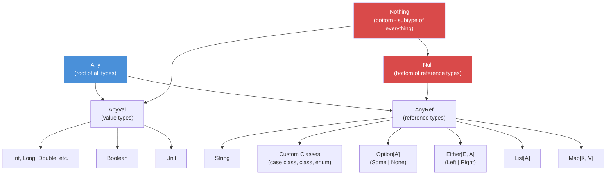
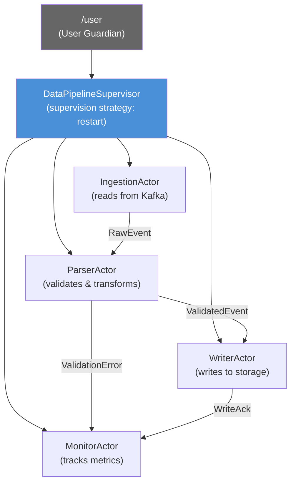
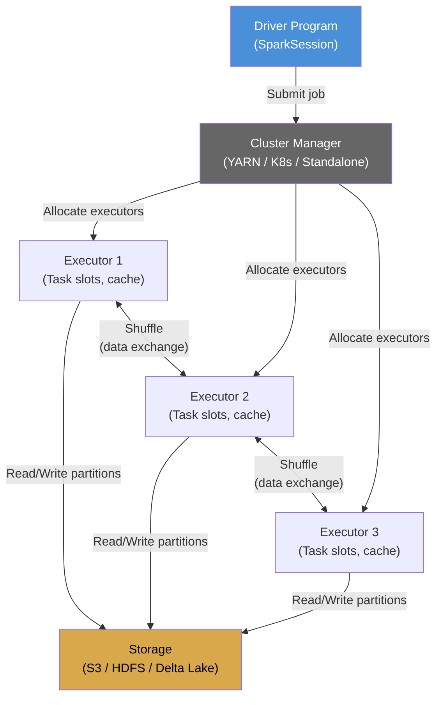

# Scala Data Engineering Fundamentals

A learning path for building robust, type-safe data pipelines and distributed systems with Scala 3.x, Akka, and Apache Spark.

---

## Audience

| Level | Badge | You Should... |
|-------|-------|---------------|
| Entry | `[Entry]` | Know basic programming. New to Scala or functional programming. |
| Mid | `[Mid]` | Write Scala comfortably. Understand FP concepts like map/flatMap. |
| Senior | `[Senior]` | Design distributed systems. Make architectural decisions. |

---

## 1. Why Scala for Data Engineering in 2026

Scala occupies a unique niche: it runs on the JVM, embraces functional programming as a first-class paradigm, and supports object-oriented design when you need it. In 2026, Scala 3.x has matured into a language that is more approachable, more consistent, and better tooling-supported than its predecessor.

### The Core Value Proposition

**Type safety at scale.** Data pipelines fail silently when types are wrong. Scala's compile-time type checking catches schema mismatches, null references, and incorrect transformations before your job runs on a 100-node cluster. In a world where a failed Spark job costs real money in compute time, catching errors at compile time is not academic -- it is economic.

**Functional programming for data transforms.** Data engineering is fundamentally about transforming data: read, validate, enrich, aggregate, write. Functional programming models this directly. Pure functions take input and produce output with no side effects. Immutable data structures mean you never accidentally mutate a shared DataFrame. Composition -- chaining small, well-typed functions into pipelines -- is the natural way to build data workflows.

**The JVM ecosystem.** Scala compiles to JVM bytecode and interoperates seamlessly with Java. This gives you access to Hadoop, Kafka, HBase, JDBC drivers, and every enterprise Java library ever written. Your Scala data service can call a Java authentication library, write to a Java-supported database, and run alongside Java microservices without friction.

**Pattern matching for data wrangling.** Real-world data is messy: different schemas across partitions, conditional logic based on event types, error handling for malformed records. Scala's pattern matching (now even more powerful in Scala 3 with union types and match types) lets you express this logic clearly and exhaustively. The compiler tells you if you missed a case.

### Who Uses Scala for Data Engineering

| Company | Use Case |
|---------|----------|
| LinkedIn | Real-time data pipelines, stream processing |
| Netflix | Recommendations infrastructure, event-driven architecture |
| Airbnb | Data platform, ETL pipelines |
| Spotify | Music recommendation, data infrastructure |
| Databricks | Apache Spark development and runtime |
| Stripe | Financial data processing, fraud detection |
| Morgan Stanley | Low-latency trading systems, risk calculations |

These companies chose Scala because their data engineering problems involve high throughput, complex transformations, and the need for correctness guarantees that dynamically typed languages cannot provide at their scale.

### The 2026 Landscape

Scala 3.x has replaced Scala 2.13 as the default for new projects. Key improvements include: optional braces (significant indentation), union and intersection types, extension methods replacing implicits, opaque type aliases, and improved compile-time error messages. Scala CLI provides a fast, script-like workflow for prototyping. The build tooling has consolidated around `sbt` 2.x and Scala CLI, with BSP (Build Server Protocol) support across all major IDEs.

---

## 2. The Scala Mental Model: FP + OO on JVM `[Entry]`

If you come from Python or Java, Scala will feel familiar in syntax but different in philosophy. The key shift is this: **Scala defaults to immutability and expression-oriented programming**, whereas Java and Python default to mutability and statement-oriented programming.

### Immutable by Default

```scala
// Scala 3.x
val numbers = List(1, 2, 3, 4, 5)   // val = immutable reference
val doubled = numbers.map(_ * 2)     // returns a NEW list, original unchanged
// numbers(0) = 10                   // compile error: List is immutable
```

Every collection transformation returns a new collection. This is not a performance problem -- Scala's persistent data structures share structure internally. It is a correctness guarantee: no function can secretly modify data you hold a reference to.

### Case Classes: Typed Data Records `[Entry]`

Case classes are Scala's primary way to model data. They are immutable, compared by value, and decomposable via pattern matching.

```scala
// Scala 3.x
case class RawEvent(
  eventId: String,
  eventType: String,
  timestamp: Long,
  payload: String,
  source: String
)

case class ValidatedEvent(
  eventId: String,
  eventType: EventType,
  timestamp: java.time.Instant,
  payload: Map[String, String]
)

enum EventType:
  case Click, Purchase, PageView, Error

// Pattern matching on the enum
def processEvent(event: ValidatedEvent): String =
  event.eventType match
    case EventType.Click    => s"Processing click: ${event.eventId}"
    case EventType.Purchase => s"Processing purchase: ${event.eventId}"
    case EventType.PageView => s"Processing page view: ${event.eventId}"
    case EventType.Error    => s"Alert: error event ${event.eventId}"
```

The compiler warns you if the match is non-exhaustive. When you add a new `EventType` later, the compiler forces you to handle it everywhere.

### For-Comprehensions: Pipeline Syntax `[Entry]`

For-comprehensions are Scala's way to chain operations that produce wrapped values (like `Option`, `Either`, `Future`, `List`). They are the idiomatic way to write data transformation pipelines.

```scala
// Scala 3.x - parsing and validating a raw event
def validate(raw: RawEvent): Either[String, ValidatedEvent] =
  for
    eventType <- EventType.fromString(raw.eventType)
                  .toRight(s"Unknown event type: ${raw.eventType}")
    instant   <- parseTimestamp(raw.timestamp)
    payload   <- parsePayload(raw.payload)
  yield ValidatedEvent(
    eventId   = raw.eventId,
    eventType = eventType,
    timestamp = instant,
    payload   = payload
  )
```

This reads top-to-bottom like a pipeline. Each line can fail (return `Left`), and the entire comprehension short-circuits on the first failure. No nested `if-else`, no `try-catch` boilerplate.

### Extension Methods and Type Classes (was Implicits) `[Mid]`

Scala 2's implicits were powerful but confusing. Scala 3 replaces the most common use cases with extension methods and given/using clauses.

```scala
// Scala 3.x - adding a method to an existing type
extension (df: DataFrame)
  def withWatermark(column: String, delay: String): DataFrame =
    df.withWatermark(column, delay)

// Type class pattern with given/using
trait JsonEncoder[A]:
  def encode(value: A): String

given JsonEncoder[ValidatedEvent] with
  def encode(event: ValidatedEvent): String =
    s"""{"id":"${event.eventId}","type":"${event.eventType}"}"""

def toJson[A](value: A)(using encoder: JsonEncoder[A]): String =
  encoder.encode(value)
```

This is how libraries like `cats`, `doobie`, and `circe` work: they define behaviors as type classes, provide instances for standard types, and let you add your own without modifying the original type.

### Scala's Type System Hierarchy



`Nothing` is the bottom type -- a subtype of everything. It is the type of expressions that never return normally (like `throw` or infinite loops). `Null` is the bottom of all reference types. Understanding this hierarchy helps you read compiler errors: when the compiler says it expected `A` but found `Nothing`, it usually means a type inference failure in a branch of your code.

### How Scala Differs from Java

| Aspect | Java | Scala |
|--------|------|-------|
| Default mutability | Mutable | Immutable |
| Null handling | Nullable by default | `Option[A]` (Some/None) |
| Error handling | Exceptions | `Either[E, A]` or `Try[A]` |
| Pattern matching | Switch (limited) | Exhaustive, decomposing match |
| Functions | First-class (since Java 8, verbose) | First-class, concise literals |
| Collections | Mutable by default | Immutable by default, lazy sequences |
| Type system | Generics, bounded | Generics, variance, union/intersection types, match types |
| Operator overloading | Not supported | Methods can be any name |

---

## 3. The Actor Model: Thinking in Messages `[Mid]` `[Senior]`

The actor model is a paradigm for concurrent and distributed computation. Instead of threads and locks, you think in terms of **actors**: independent entities that communicate exclusively by sending messages to each other. No shared memory, no locks, no race conditions.

### Why the Actor Model for Data Systems

Traditional concurrency uses shared memory protected by locks. This works for small systems but breaks down at scale: lock contention, deadlocks, and the sheer difficulty of reasoning about interleaved mutations make shared-state concurrency unmanageable in distributed data pipelines.

The actor model eliminates these problems by fiat. Each actor owns its state privately. The only way to interact with an actor is to send it a message. Messages are processed one at a time, in order. There is no shared mutable state, so there are no race conditions.

### Akka Actors in Scala 3

```scala
// Scala 3.x with Akka
import org.apache.pekko.actor.*

object EventProcessor:
  // Messages (always use case classes/objects)
  case class ProcessEvent(event: ValidatedEvent)
  case class GetStats(replyTo: ActorRef[StatsResponse])
  case class StatsResponse(processed: Long, errors: Long)

class EventProcessor extends Actor:
  import EventProcessor.*

  private var processed: Long = 0
  private var errors: Long = 0

  def receive: Receive =
    case ProcessEvent(event) =>
      // Process the event
      processed += 1
    case GetStats(replyTo) =>
      replyTo ! StatsResponse(processed, errors)
```

Key rules for Akka actors:
1. **Messages must be immutable.** Use case classes or case objects.
2. **Never close over mutable state in a Future inside an actor.** If you need to fork work, pipe the result back as a message.
3. **Actors should not block.** Blocking operations go in dedicated dispatchers.

### Supervision Hierarchy



The supervision hierarchy determines what happens when an actor fails. A parent actor defines a supervision strategy:

- **Resume** -- skip the failed message, continue processing.
- **Restart** -- destroy the failed actor, create a new one with fresh state.
- **Stop** -- terminate the actor permanently.
- **Escalate** -- let the parent's parent decide.

For data pipelines, the restart strategy is most common: if a writer actor fails due to a transient database error, restart it with clean state and let the upstream replay the message.

### Location Transparency `[Senior]`

Akka actors can run on the same JVM or on different nodes in a cluster. The message-sending API is identical. This is location transparency: you write your actors as if they are local, and the Akka cluster infrastructure handles serialization, network transport, and message routing.

This matters for data engineering because you can prototype a pipeline on a single machine, then deploy it across a cluster without changing your actor code. Only the configuration changes.

---

## 4. Akka Streams: Reactive Streaming `[Mid]`

Akka Streams implements the Reactive Streams specification. It provides a typed, composable API for processing streams of data with built-in **backpressure** -- the mechanism that ensures a fast producer cannot overwhelm a slow consumer.

### Why Backpressure Matters

Without backpressure, a data pipeline that reads from Kafka faster than it can write to a database will buffer messages in memory until the JVM runs out of heap and crashes. This is not theoretical; it is the most common failure mode in streaming pipelines.

Backpressure solves this by creating a feedback loop: the downstream consumer tells the upstream producer how many elements it can handle. The producer only sends that many. If the consumer is slow, the producer slows down. If the consumer catches up, the producer speeds up. The pipeline self-regulates.

### Stream Components

```scala
// Scala 3.x with Akka Streams
import org.apache.pekko.actor.ActorSystem
import org.apache.pekko.stream.scaladsl.*
import org.apache.pekko.stream.*
import org.apache.pekko.{Done, NotUsed}
import scala.concurrent.Future

given system: ActorSystem = ActorSystem("DataStream")

// Source: where data enters the stream
val kafkaSource: Source[RawEvent, NotUsed] =
  Source.fromIterator(() => eventIterator)
    .throttle(1000, 1.second)  // rate limit: 1000 events/sec

// Flow: a processing stage (transforms elements)
val validateFlow: Flow[RawEvent, ValidatedEvent, NotUsed] =
  Flow[RawEvent]
    .map(raw => validate(raw))
    .collect:
      case Right(valid) => valid
    .filter(_.eventType != EventType.Error)

// Sink: where data exits the stream
val databaseSink: Sink[ValidatedEvent, Future[Done]] =
  Sink.foreach(validated => writeToDatabase(validated))

// Connect them into a runnable graph
val pipeline: RunnableGraph[Future[Done]] =
  kafkaSource
    .via(validateFlow)
    .toMat(databaseSink)(Keep.right)

// Materialize and run
val result: Future[Done] = pipeline.run()
```

### Custom Graph Stages `[Senior]`

When built-in stages are not enough, you can implement custom graph stages with fine-grained control over backpressure signaling:

```scala
// Scala 3.x - simplified custom stage that batches elements
import org.apache.pekko.stream.stage.*
import org.apache.pekko.stream.*

class BatchingStage(batchSize: Int)
    extends GraphStage[FlowShape[ValidatedEvent, Seq[ValidatedEvent]]]:

  val in  = Inlet[ValidatedEvent]("BatchingStage.in")
  val out = Outlet[Seq[ValidatedEvent]]("BatchingStage.out")

  val shape: FlowShape[ValidatedEvent, Seq[ValidatedEvent]] =
    FlowShape(in, out)

  def createLogic(inheritedAttributes: Attributes): GraphStageLogic =
    new GraphStageLogic(shape):
      var buffer: Vector[ValidatedEvent] = Vector.empty

      setHandler(in, new InHandler:
        def onPush(): Unit =
          buffer = buffer :+ grab(in)
          if buffer.size >= batchSize then
            push(out, buffer)
            buffer = Vector.empty
          else
            pull(in)
      )

      setHandler(out, new OutHandler:
        def onPull(): Unit =
          if buffer.nonEmpty && isAvailable(in) then
            push(out, buffer)
            buffer = Vector.empty
          pull(in)
      )
```

### Materialization

Akka Streams separates **blueprint** from **execution**. You define a graph of sources, flows, and sinks. This graph is a blueprint -- it describes what should happen but does nothing. When you call `run()`, the graph is **materialized**: Akka allocates actors, buffers, and network connections to execute the blueprint. A single blueprint can be materialized multiple times with different configurations.

---

## 5. Apache Spark: Distributed Data Processing `[Entry]` `[Mid]`

Apache Spark is the dominant framework for large-scale distributed data processing. It is written in Scala, and while it offers APIs in Python (PySpark), SQL, and R, the Scala API provides the most complete feature set and the best performance because it avoids serialization overhead between JVM and Python processes.

### The Programming Model

Spark provides three abstractions, in order of preference for 2026:

| Abstraction | Level | When to Use |
|-------------|-------|-------------|
| Spark SQL / DataFrames | High | Most data engineering tasks. Optimized by Catalyst. |
| Datasets | Typed | When you need compile-time type safety. |
| RDDs | Low | Only when you need fine-grained control over partitioning. |

**Use DataFrames.** They are the primary API. The Catalyst optimizer transforms your DataFrame operations into an efficient physical execution plan. You get the performance of hand-tuned code without the effort.

```scala
// Scala 3.x with Spark 4.x
import org.apache.spark.sql.SparkSession
import org.apache.spark.sql.functions.*

val spark = SparkSession.builder()
  .appName("EventDataPipeline")
  .config("spark.sql.adaptive.enabled", "true")   // AQE on by default in 4.x
  .getOrCreate()

import spark.implicits.*

// Read from Parquet
val rawEvents = spark.read.parquet("s3://data-lake/raw/events/2026/06/")

// Transform with DataFrame API
val enriched = rawEvents
  .filter(col("eventType").isNotNull)
  .withColumn("eventDate", to_date(col("timestamp")))
  .withColumn("hour", hour(col("timestamp")))
  .groupBy("eventDate", "hour", "eventType")
  .agg(
    count("*").as("eventCount"),
    approx_count_distinct("userId").as("uniqueUsers")
  )

// Write to curated zone
enriched.write
  .mode("overwrite")
  .partitionBy("eventDate")
  .parquet("s3://data-lake/curated/events_hourly/")
```

### Spark SQL

For analysts and data engineers who prefer SQL, Spark SQL lets you register DataFrames as temporary views and query them:

```sql
-- Run directly in Spark SQL
SELECT
  eventDate,
  hour,
  eventType,
  eventCount,
  uniqueUsers,
  eventCount / SUM(eventCount) OVER (PARTITION BY eventDate) AS pctOfDayly
FROM events_hourly
WHERE eventDate = '2026-06-07'
ORDER BY hour, eventType
```

### The Catalyst Optimizer

The Catalyst optimizer is what makes Spark fast. When you write a DataFrame transformation, Catalyst:

1. **Resolves** column references and types against the schema.
2. **Logical optimization** applies rules like predicate pushdown (push filters close to the data source), column pruning (only read needed columns), and constant folding.
3. **Physical planning** generates one or more physical plans, costing each one and selecting the cheapest.
4. **Code generation** (Tungsten/Whole-Stage CodeGen) compiles the physical plan into JVM bytecode at runtime.

You do not need to hand-optimize your queries. Write clear, readable transformations. Catalyst handles the rest.

### Spark Execution Model



The **driver** holds the SparkSession and converts your code into a logical plan. The **cluster manager** allocates executors. Each **executor** runs tasks on data partitions. **Shuffles** are the expensive operation where data is exchanged between executors (e.g., during a `groupBy`). Minimizing shuffles is the primary performance optimization in Spark.

### Adaptive Query Execution (AQE) `[Mid]`

Spark 4.x enables AQE by default. AQE re-optimizes the query plan at runtime based on statistics collected during execution:

- **Coalesces post-shuffle partitions** -- avoids running many small tasks.
- **Switches join strategies** -- converts sort-merge joins to broadcast joins when one side is small.
- **Optimizes skewed joins** -- splits skewed partitions to avoid stragglers.

Let AQE do its job. Resist the urge to manually set `spark.sql.shuffle.partitions` unless profiling shows a clear need.

---

## 6. Framework and Ecosystem Landscape `[Mid]` `[Senior]`

Scala's data engineering ecosystem is broad. Choosing the right tool depends on your use case.

### The Major Frameworks

**Akka** (actor model, streams, cluster). Best for: real-time event processing, microservices, systems requiring fine-grained concurrency control. Akka (now Apache Pekko for the open-source fork) provides the actor model, streaming with backpressure, and cluster distribution. Use it when you need to build the infrastructure yourself, with full control over message routing, failure handling, and deployment topology.

**Apache Spark** (batch and streaming). Best for: large-scale batch ETL, interactive analytics, ML pipelines. Spark is the default choice for data lake processing. It reads from and writes to S3/HDFS/Delta Lake, handles terabytes to petabytes, and provides a SQL interface for analysts.

**Apache Flink** (streaming-first). Best for: low-latency stream processing, event-time processing, stateful computations. Flink competes with Spark Structured Streaming but offers stronger guarantees for exactly-once processing and more sophisticated state management. Some teams use Flink for real-time and Spark for batch.

**Kafka Streams** (embedded streaming). Best for: microservices that consume/produce Kafka topics. Kafka Streams is a lightweight library (not a cluster) that runs inside your application. It is ideal when your data flows through Kafka and you need to transform, aggregate, or join streams without deploying a separate processing cluster.

### Comparison Table

| Feature | Akka Streams | Spark | Flink | Kafka Streams |
|---------|-------------|-------|-------|---------------|
| Primary model | Actor/stream | Batch + micro-batch | True streaming | Stream processing |
| Latency | Milliseconds | Seconds (batch) / sub-second (streaming) | Milliseconds | Milliseconds |
| State management | Custom | Spark checkpointing | RocksDB / heap | RocksDB / in-memory |
| Backpressure | Built-in (Reactive Streams) | Not applicable | Built-in | Not applicable |
| Deployment | Embedded or cluster | Cluster (YARN/K8s) | Cluster | Embedded in app |
| SQL support | None | Spark SQL | Flink SQL | None |
| ML integration | None | Spark MLlib | Flink ML | None |
| Learning curve | Moderate | Moderate | Steep | Low |
| Best for | Custom pipelines | Data lake ETL | Low-latency streaming | Kafka-centric apps |

---

## 7. Decision Framework: When Scala vs Others `[Senior]`

Scala is not always the right choice. Here is when it shines and when another language is more appropriate.

### Scala vs Python

Choose Scala when: type safety matters (complex schemas, financial data), you need JVM performance and ecosystem, your team is comfortable with FP, or you are doing heavy Spark work where PySpark's serialization overhead is a bottleneck.

Choose Python when: your team is stronger in Python, you need rapid prototyping, you are doing ML/AI work (scikit-learn, PyTorch ecosystem), or the data pipeline is simple enough that type safety provides diminishing returns.

### Scala vs Java

Choose Scala when: you want more concise code (case classes, pattern matching, for-comprehensions), you benefit from FP idioms (immutable data, pure functions), or you are building streaming/concurrent systems where actor model or Akka Streams is the right abstraction.

Choose Java when: your organization has deep Java expertise and no Scala experience, you need maximum library compatibility (some edge-case Java libraries have Scala interop quirks), or hiring Scala developers is difficult in your market.

### Scala vs Go

Choose Scala when: you need the JVM ecosystem (Hadoop, Kafka, Spark), your workloads are data-heavy and benefit from Spark/Flink, or you need sophisticated type-level programming.

Choose Go when: you need small, fast-starting binaries, your services are network/HTTP microservices (not data pipelines), you want simplicity over expressiveness, or you are building CLI tools and infrastructure utilities.

### Decision Table

| Criterion | Prefer Scala | Prefer Python | Prefer Java | Prefer Go |
|-----------|-------------|---------------|-------------|-----------|
| Type safety | High need | Low need | Medium need | Medium need |
| Team expertise | FP/OO | Scripting | OOP | Systems |
| Data scale | Petabytes | Gigabytes | Terabytes | Not primary |
| Spark usage | Primary API | PySpark | Spark Java | N/A |
| Streaming | Akka/Flink | Limited | Limited | Custom |
| JVM ecosystem | Required | Not needed | Required | Not needed |
| Time to prototype | Acceptable trade-off | Critical | Slow | Fast |
| Hiring pool | Niche | Large | Large | Growing |

---

## 8. Common Pitfalls `[Mid]` `[Senior]`

### Implicit Scope Confusion

Scala 2 implicits can resolve from unexpected scopes, causing "where did this value come from?" confusion. Scala 3's `given`/`using` syntax makes this more explicit, but the issue persists: if you have multiple `given` instances of the same type in scope, the compiler picks one based on specificity rules that are not always intuitive.

**Mitigation:** Keep `given` definitions close to where they are used. Avoid wildcard imports of libraries that define many `given` instances. When you see a "ambiguous given instances" error, explicitly pass the instance using `using`.

### Future vs Task

Scala's standard library `Future` is eager -- it starts executing immediately upon creation. This is different from `cats.effect.IO` or `ZIO`'s `Task`, which are lazy -- they describe a computation but do not execute it until explicitly run.

```scala
// Eager: starts immediately
val f: Future[String] = Future {
  fetchDataFromDatabase()  // runs NOW
}

// Lazy: describes computation
val t: IO[String] = IO {
  fetchDataFromDatabase()  // does NOT run yet
}
```

**Mitigation:** For simple data pipeline code, `Future` is fine. For complex effect systems (retry logic, resource management, cancellation), use `cats.effect.IO` or `ZIO`.

### Blocking in Actor Systems

Never perform blocking I/O (JDBC calls, HTTP requests, file reads) inside an actor's `receive` method. The actor's thread is shared with other actors on the same dispatcher. Blocking one actor blocks them all.

**Mitigation:** Use a dedicated dispatcher for blocking operations, or pipe the result of a Future back to the actor as a message:

```scala
// Correct pattern: pipe result back as message
def receive: Receive =
  case ProcessEvent(event) =>
    val result: Future[WriteResult] = Future {
      writeToDatabase(event)  // runs on separate thread pool
    }
    result.pipeToSelf(self):
      case Success(res) => WriteComplete(res)
      case Failure(ex)  => WriteFailed(ex)
```

### Spark Shuffle Overhead

Shuffles are the most expensive operation in Spark. A `groupBy("key")` on a large dataset can shuffle terabytes of data across the network. Symptoms: jobs that spend 90% of time in shuffle stages, out-of-memory errors during shuffle, skewed partition sizes.

**Mitigation:**
- Use `reduceByKey` instead of `groupByKey` when possible (reduces shuffle volume).
- Enable AQE and let it handle skewed joins.
- Pre-aggregate before shuffling.
- Use partitioning strategies that co-locate related data (e.g., partition by date).

### JVM Tuning for Data Workloads

The JVM's default garbage collector is not tuned for data engineering workloads, which tend to allocate large, short-lived objects (parsed records, intermediate results).

**Mitigation:**
- Use G1GC or ZGC for low-latency streaming workloads.
- Set `-Xmx` and `-Xms` to the same value to avoid heap resizing.
- Monitor GC pauses with JVM metrics. If pauses exceed your latency budget, switch to ZGC.
- For Spark, use the tungsten memory manager (on by default) which operates off-heap.

---

## 9. What's Next

This guide covers the fundamentals. The learning path continues with:

- **Module 2:** Building a Kafka-to-Delta-Lake pipeline with Akka Streams and Spark Structured Streaming.
- **Module 3:** Type-safe data transformations with `cats`, `circe`, and generic programming.
- **Module 4:** Testing data pipelines: property-based testing, integration testing with test containers.
- **Module 5:** Production operations: monitoring, alerting, schema evolution, data quality checks.

Each module includes hands-on exercises, reference implementations, and review questions calibrated to `[Entry]`, `[Mid]`, and `[Senior]` levels.

---

## References

- [Scala 3 Documentation](https://docs.scala-lang.org/scala3/)
- [Apache Spark Documentation](https://spark.apache.org/docs/latest/)
- [Akka / Apache Pekko Documentation](https://pekko.apache.org/)
- [Cats Effect Documentation](https://typelevel.org/cats-effect/)
- [Scala CLI](https://scala-cli.virtuslab.org/)
- [Delta Lake](https://delta.io/)

---

*Part of the TP-Coder Innovation Hub learning paths.*
